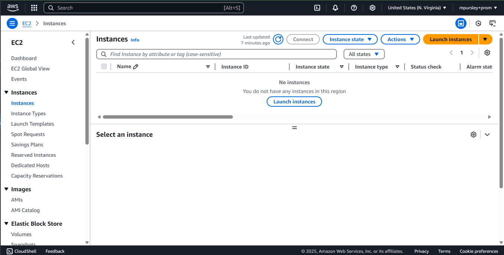
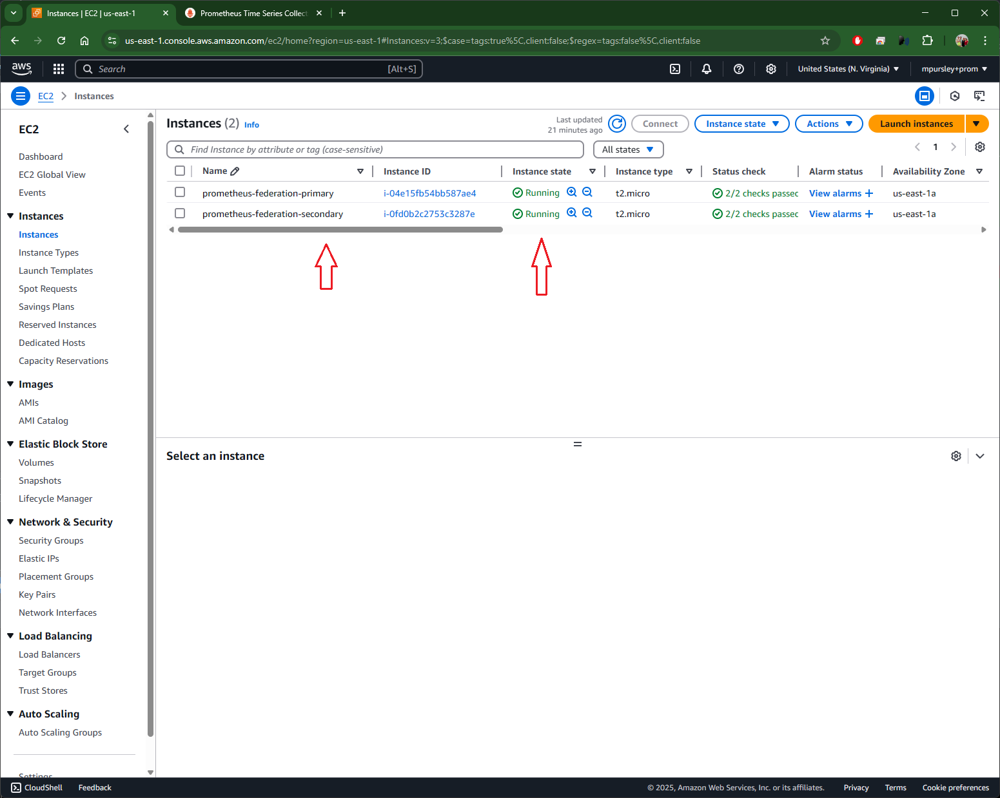
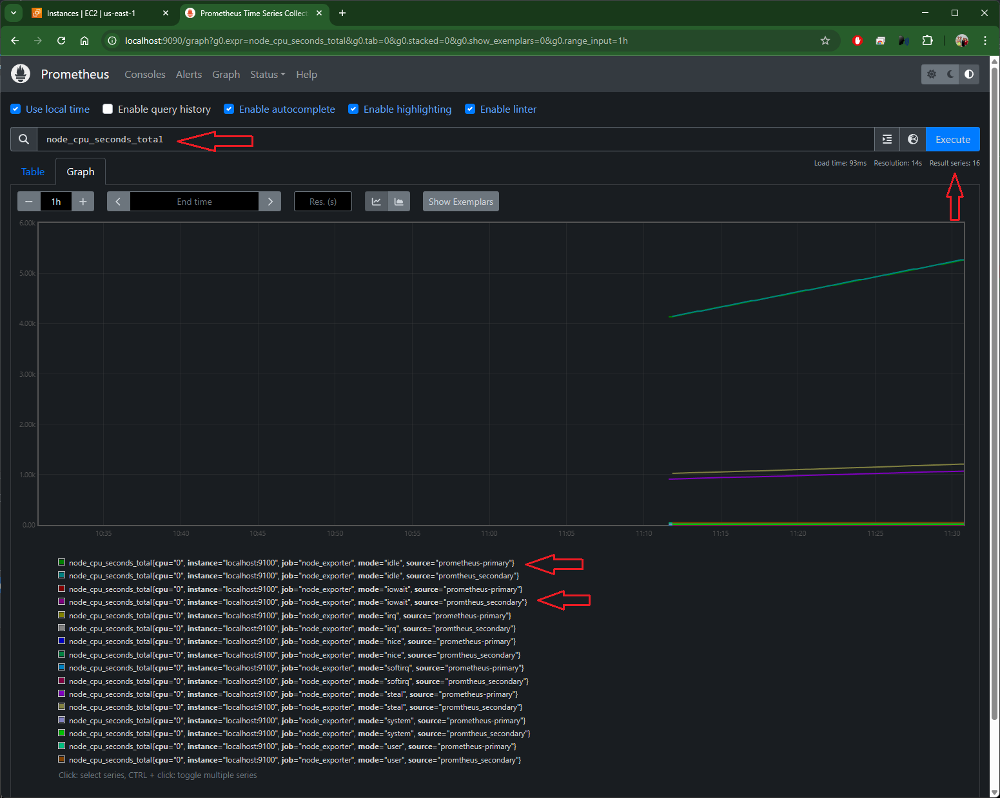
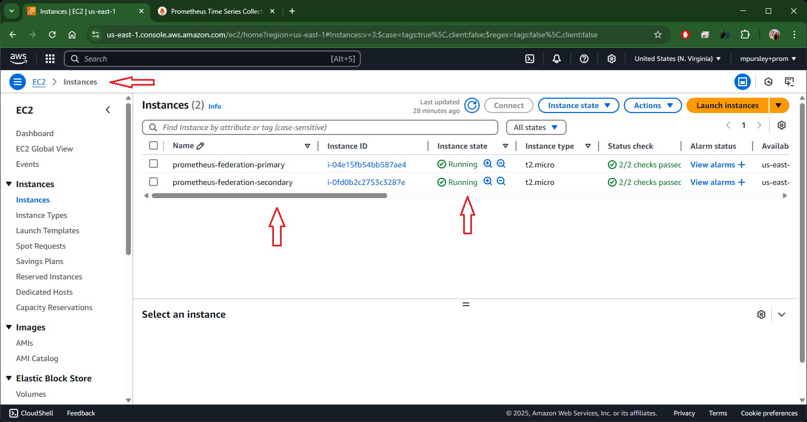
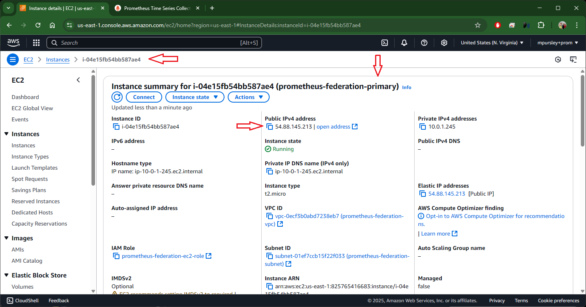
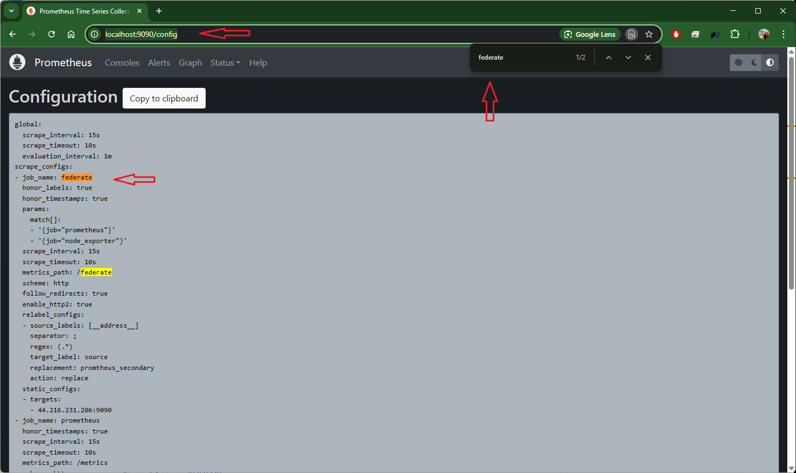
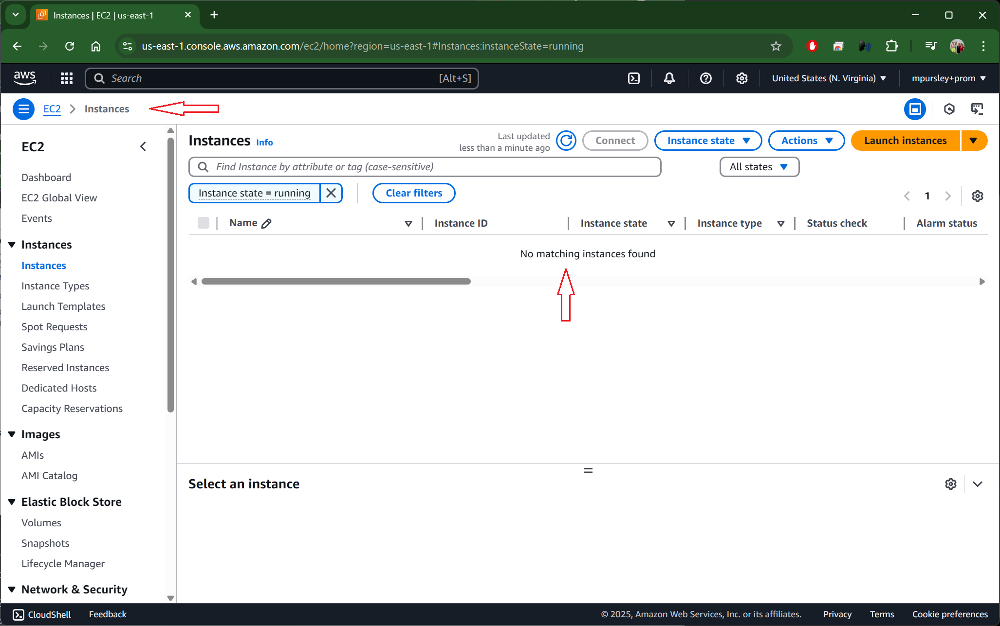

## Repo Summary

Terraform Project to:
- Setup two Ubuntu cloud servers (aws) that run Prometheus in a hierarchical federation model, and scrape some basic metrics from each into the primary instance.
- Use mostly Terraform and ansible
- Consider security features are in place, and how the automation toolchains inherit that security.
- Not be a full production-ready implementation, but you should follow best practices with each technology in use.
- Budget: Max 2 hours

## How To:
### Start or update the infrastructure
NOTE: This repo is in-development, some work-arounds are required... See `TODO:` for examples

If you haven't run terraform in this project before...
```
$ terraform init
```
Note: No ec2 instances or related infrastructure is running, as terraform hasn't been run yet... 


First run a `terraform plan`, to see what changes will be needed...
```
$ terraform plan

```

Then run a `terraform apply` to add the needed changes...
```
$ terraform apply
```

WARNING: The terraform code to run to automatically run ansible script is still work-in-progress.
You will likely get error(s) like this on the first run...
TODO: Fix these inventory checks... 

```
$ terraform apply
...
Plan: 13 to add, 0 to change, 0 to destroy.

Changes to Outputs:
  + primary_public_ip   = (known after apply)
  + secondary_public_ip = (known after apply)

Do you want to perform these actions?
  Terraform will perform the actions described above.
  Only 'yes' will be accepted to approve.

  Enter a value: yes

aws_vpc.main: Creating...
aws_iam_role.ec2_role: Creating...
...

null_resource.run_ansible_playbook (local-exec): PLAY RECAP *********************************************************************
null_resource.run_ansible_playbook (local-exec): prometheus-primary         : ok=0    changed=0    unreachable=1    failed=0    skipped=0    rescued=0    ignored=0
null_resource.run_ansible_playbook (local-exec): prometheus-secondary       : ok=0    changed=0    unreachable=1    failed=0    skipped=0    rescued=0    ignored=0

│ Error: local-exec provisioner error
│
│   with null_resource.run_ansible_playbook,
│   on main.tf line 205, in resource "null_resource" "run_ansible_playbook":
│  205:   provisioner "local-exec" {
│
│ Error running command 'ansible-playbook -i inventory.ini ansible_install_prometheus.yaml': exit status 4. Output:
│ PLAY [prometheus_servers] ******************************************************
│
│ TASK [Gathering Facts] *********************************************************
│ fatal: [prometheus-primary]: UNREACHABLE! => {"changed": false, "msg": "Failed to connect to the host via ssh: ssh: connect to
│ host 52.23.95.168 port 22: Connection timed out", "unreachable": true}
│ fatal: [prometheus-secondary]: UNREACHABLE! => {"changed": false, "msg": "Failed to connect to the host via ssh: ssh: connect to
│ host 3.231.201.117 port 22: Connection timed out", "unreachable": true}
│
│ PLAY RECAP *********************************************************************
│ prometheus-primary         : ok=0    changed=0    unreachable=1    failed=0    skipped=0    rescued=0    ignored=0
│ prometheus-secondary       : ok=0    changed=0    unreachable=1    failed=0    skipped=0    rescued=0    ignored=0
│

│ Error: local-exec provisioner error
│
│   with null_resource.run_ansible_playbook,
│   on main.tf line 205, in resource "null_resource" "run_ansible_playbook":
│  205:   provisioner "local-exec" {
```
NOTE: The Ec2 instances are running... e.g.


But, if this is the first run, the ansible_playbook might not complete and put out errors.
To work around these errors, we can run the `ansible_playbook` manual (once) to accomedate.
- Go to AWS Console -> EC2 -> Instances -> prometheus-federation-primary -> Public IPv4 address -> Note the IP
- Go to AWS Console -> EC2 -> Instances -> prometheus-federation-secondary -> Public IPv4 address -> Note the IP


Manually run the `ansible_generate_inventory.bash` script and `ansible_install_prometheus.yaml` playbook...
NOTE: This should only need to be run "the first time"...
```
$ cd ansible

$ ./ansible_generate_inventory.bash
INFO    : Getting Public IP address for ec2 instances (this normally takes a few seconds)...
Primary Public IP:       terraform output:       184.73.135.159
Primary Public IP:       aws ec2 describe:       54.88.145.213
Secondary Public IP:     terraform output:       34.228.161.30
Secondary Public IP:     aws ec2 describe:       44.216.231.206


WARNING : These Public IP checks from Terraform and AWS don't always seem to work correctly yet.
        : Double check these Public IP are correct using the AWS Console...

Primary Public IP:       aws ec2 describe:       54.88.145.213
Secondary Public IP:     aws ec2 describe:       44.216.231.206

Inventory file 'inventory.ini' generated.

WARNING: ssh'ing into the primary and secondary prometheus nodes. This should print their hostnames.
ip-10-0-1-245
ip-10-0-1-19

INFO   : Ok, done. The 'inventory.ini' file should be updated. You can now run the ansible_playbook(s) in this folder..
       : e.g.
       : $ ansible-playbook -i inventory.ini ansible_install_prometheus.yaml

$ ansible-playbook -i inventory.ini ansible_install_prometheus.yaml

PLAY [prometheus_servers] ***********************************************************************************************************

TASK [Gathering Facts] **************************************************************************************************************
ok: [prometheus-secondary]
ok: [prometheus-primary]

...

TASK [Start Node Exporter] **********************************************************************************************************
changed: [prometheus-primary]
changed: [prometheus-secondary]

PLAY RECAP **************************************************************************************************************************
prometheus-primary         : ok=20   changed=17   unreachable=0    failed=0    skipped=1    rescued=0    ignored=0
prometheus-secondary       : ok=19   changed=16   unreachable=0    failed=0    skipped=2    rescued=0    ignored=0


```

### Validate the infrastructure and Prometheus instances are working as expected
```
$ cat ./inventory.ini
[prometheus_servers]
prometheus-primary ansible_host=54.88.145.213
prometheus-secondary ansible_host=44.216.231.206

[prometheus_servers:vars]
ansible_ssh_private_key_file=~/.ssh/prometheus-key-pair.pem
ansible_connection=ssh
ansible_user=ubuntu
mpurs@LAPTOP-B3L71GAM:~/git/prometheus-federation/ansible$ ./ssh_prom_with_portforward_to_webui.sh 54.88.145.213
ip-10-0-1-245

ubuntu@ip-10-0-1-245:~$ systemctl status | egrep 'prometheus|node_exporter'
           │   │ └─5243 grep -E --color=auto prometheus|node_exporter
             ├─prometheus.service
             │ └─3074 /usr/local/bin/prometheus --config.file /etc/prometheus/prometheus.yml --storage.tsdb.path /var/lib/prometheus/ --web.console.templates=/etc/prometheus/consoles --web.console.libraries=/etc/prometheus/console_libraries
             ├─node_exporter.service
             │ └─3316 /usr/local/bin/node_exporter --web.listen-address=:9100
ubuntu@ip-10-0-1-245:~$

```

Go to http://localhost:9090/graph and check for metrics from `source="prometheus-primary"` and `source="promtheus_secondary`
e.g.
- http://localhost:9090/graph?g0.expr=node_cpu_seconds_total&g0.tab=0&g0.stacked=0&g0.show_exemplars=0&g0.range_input=1h


To check the Prometheus settings, including for /federate, see:
- http://localhost:9090/config


### Validate the terraform is able to update the infra...
Re-run `terraform plan` and `terraform apply` to verify the repo is able to update the infrastructure... 
```
$ terraform plan
## Double check the plan output...

$ terraform apply
aws_iam_role.ec2_role: Refreshing state... [id=prometheus-federation-ec2-role]
aws_vpc.main: Refreshing state... [id=vpc-0ecf3b0abd7238eb7]
aws_iam_instance_profile.ec2_profile: Refreshing state... [id=prometheus-federation-ec2-profile]
aws_security_group.prometheus_sg: Refreshing state... [id=sg-0787245cb12208501]
aws_internet_gateway.gw: Refreshing state... [id=igw-02bc41434332ea067]
aws_subnet.main: Refreshing state... [id=subnet-01ef7ccb15f22f033]
aws_instance.prometheus-primary: Refreshing state... [id=i-04e15fb54bb587ae4]
aws_instance.prometheus-secondary: Refreshing state... [id=i-0fd0b2c2753c3287e]
aws_route_table.r: Refreshing state... [id=rtb-088b536f26af826d8]
aws_route_table_association.a: Refreshing state... [id=rtbassoc-02b5e1c98a706d315]
aws_eip.secondary_eip: Refreshing state... [id=eipalloc-050e6ce6c48defd18]
aws_eip.primary_eip: Refreshing state... [id=eipalloc-0623939f7b2757573]
null_resource.run_ansible_playbook: Refreshing state... [id=3448376722662151744]

No changes. Your infrastructure matches the configuration.

Terraform has compared your real infrastructure against your configuration and found no differences, so no changes are
needed.

Apply complete! Resources: 0 added, 0 changed, 0 destroyed.

Outputs:

primary_public_ip = "54.88.145.213"
secondary_public_ip = "44.216.231.206"
```
### How To: Teardown/destroy the related infrastructure
**WARNING: This is a Dev/Test system, but the data is not (currently) stored persistently . **
**       : This `terraform destroy` process will delete/remove all collected metrics! **
**       : If you want to keep any of the metrics, scripts, tests or other data from this system, copy and backup that data now!!**  

Show the running instances...
```
$ aws ec2 describe-instances --filters "Name=instance-state-name,Values=running" --query "Reservations[*].Instances[*].[InstanceId, Tags[?Key=='Name'].Value]" --output table
-------------------------------------
|         DescribeInstances         |
+-----------------------------------+
|  i-0fd0b2c2753c3287e              |
|  prometheus-federation-secondary  |
|  i-04e15fb54bb587ae4              |
|  prometheus-federation-primary    |
+-----------------------------------+
```


Run `terraform destroy` to remove the included infrastructure.
Note: See a full example of the output in [docs/terraform_output_examples.md](docs/terraform_output_examples.md)
```
$ terraform destroy
aws_iam_role.ec2_role: Refreshing state... [id=prometheus-federation-ec2-role]
aws_vpc.main: Refreshing state... [id=vpc-0ecf3b0abd7238eb7]
aws_iam_instance_profile.ec2_profile: Refreshing state... [id=prometheus-federation-ec2-profile]
,,,
Plan: 0 to add, 0 to change, 13 to destroy.

Changes to Outputs:
  - primary_public_ip   = "54.88.145.213" -> null
  - secondary_public_ip = "44.216.231.206" -> null

Do you really want to destroy all resources?
  Terraform will destroy all your managed infrastructure, as shown above.
  There is no undo. Only 'yes' will be accepted to confirm.

  Enter a value: yes

null_resource.run_ansible_playbook: Destroying... [id=3448376722662151744]
null_resource.run_ansible_playbook: Destruction complete after 0s
aws_route_table_association.a: Destroying... [id=rtbassoc-02b5e1c98a706d315]
...
aws_vpc.main: Destroying... [id=vpc-0ecf3b0abd7238eb7]
aws_iam_role.ec2_role: Destruction complete after 0s
aws_vpc.main: Destruction complete after 1s

Destroy complete! Resources: 13 destroyed.
$
```

Validate that the related infrastructure was stopped and removed... 
```
$ aws ec2 describe-instances --filters "Name=instance-state-name,Values=running" --query "Reservations[*].Instances[*].[InstanceId, Tags[?Key=='Name'].Value]" --output json
[]

$ terraform destroy

No changes. No objects need to be destroyed.

Either you have not created any objects yet or the existing objects were already deleted outside of Terraform.

$
```



## TODO:
For items that are `work-in-progress`, `needs improvement`, `security concerns`, etc, see here:
- [docs/README_todo_items.md](docs/README_todo_items.md)
